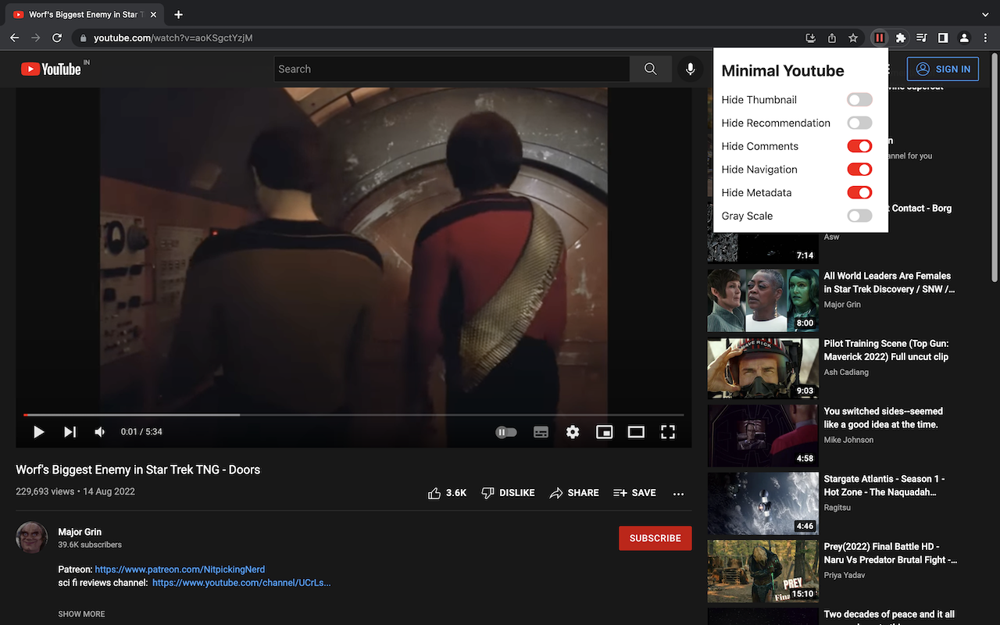
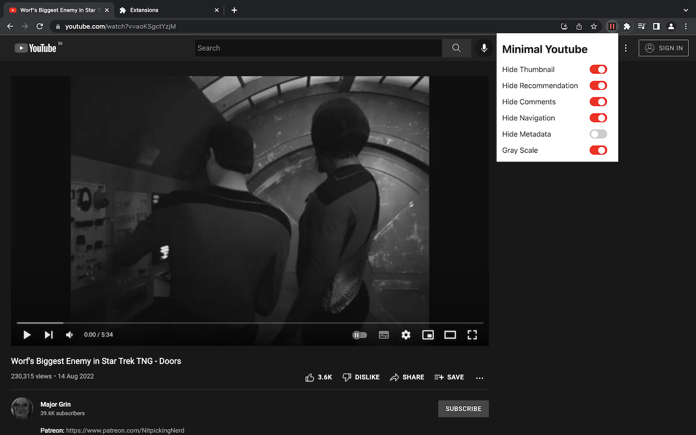
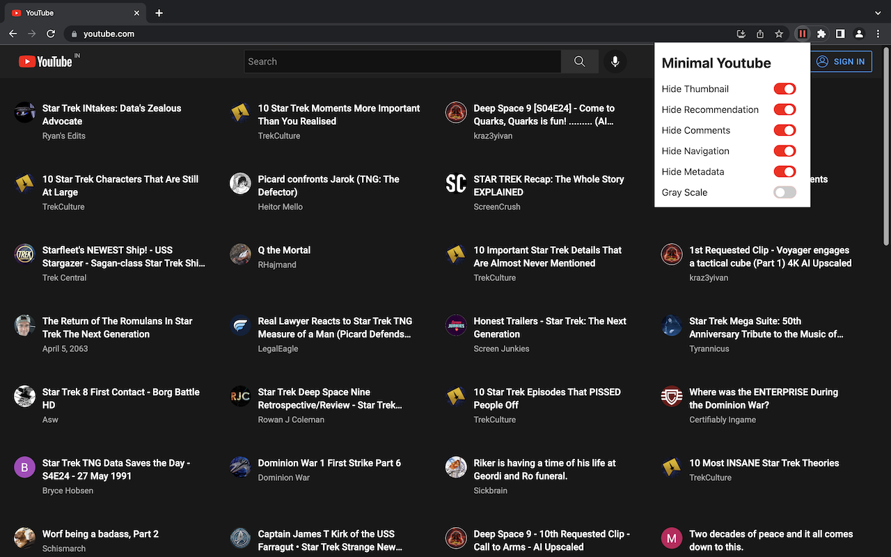

# Minimal Youtube theme

A simple chrome extension to make youtube boring and less distractive.


## How does it look?





## To run

```
$ pnpm
$ pnpm start
```

## Similar extensions

- [Minimal theme for twitter](https://github.com/thomaswang/minimal-twitter)
